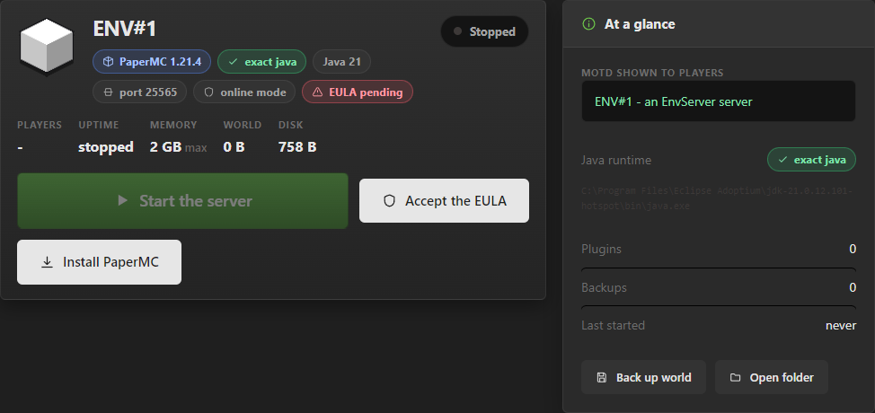
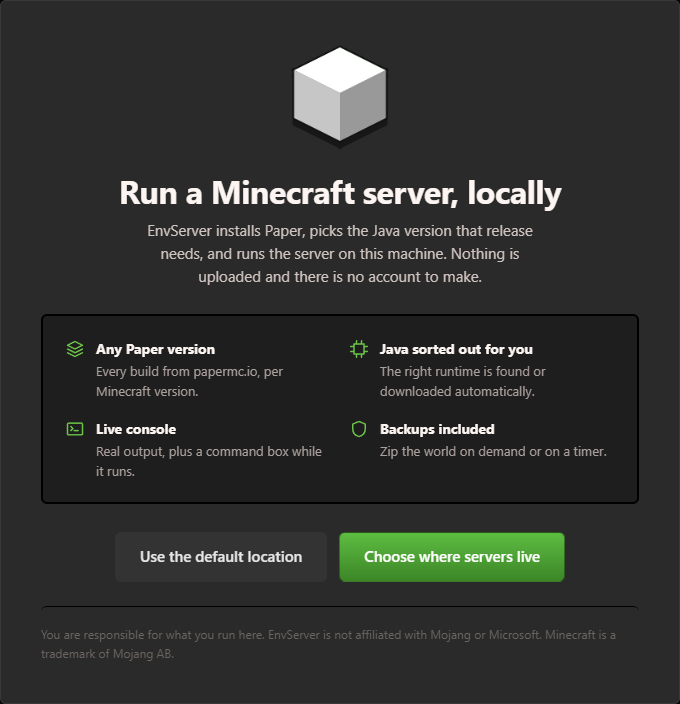
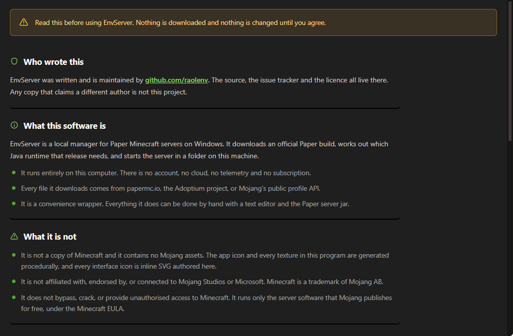
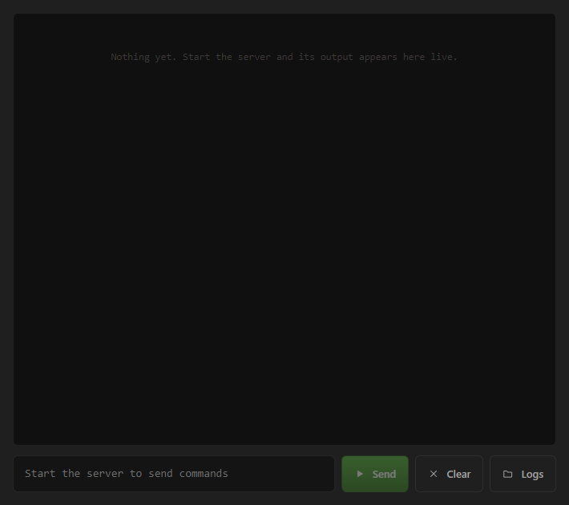
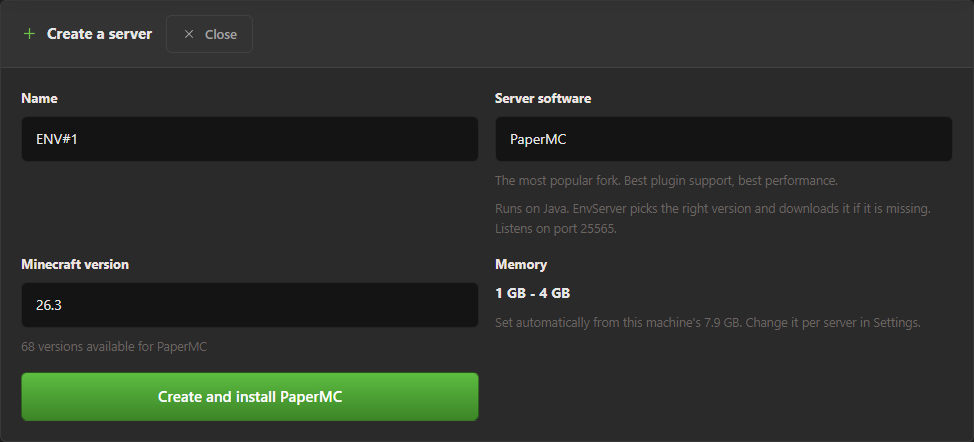
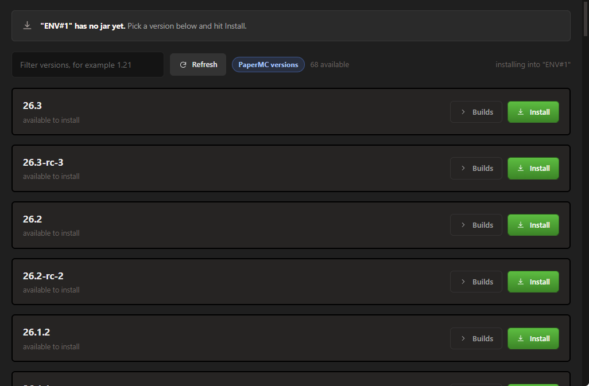
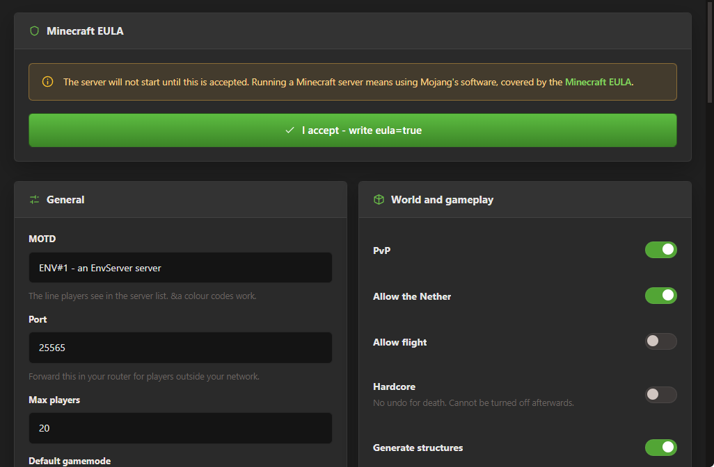
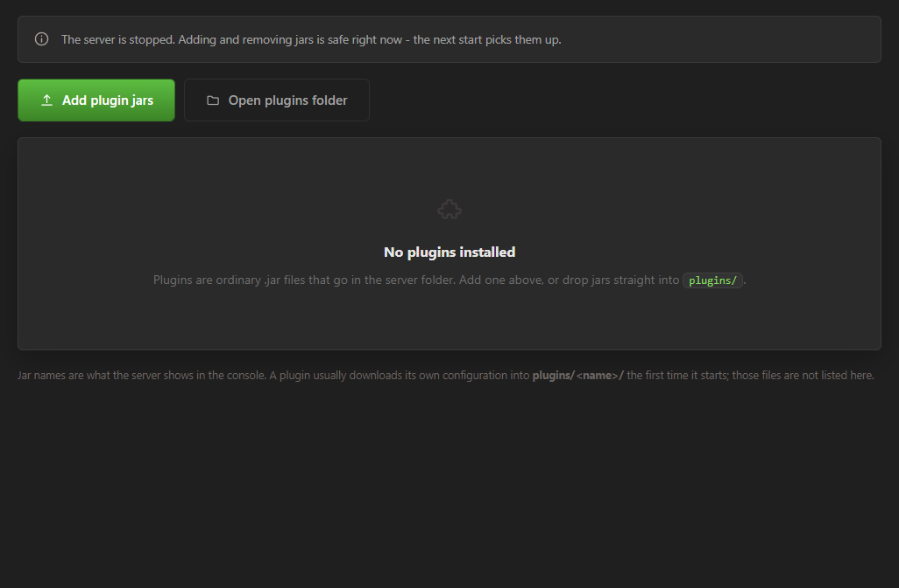
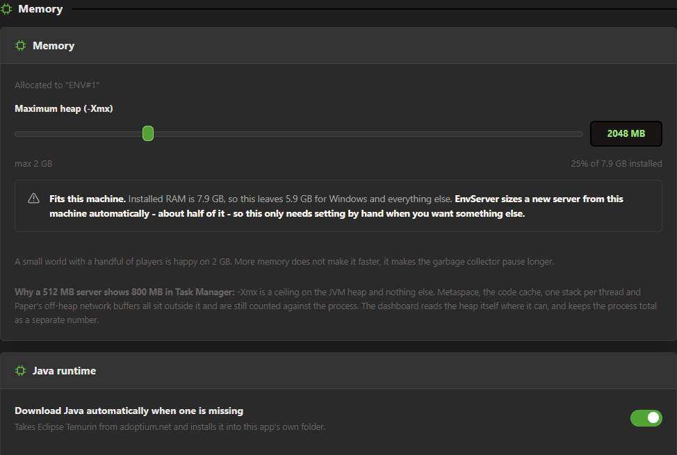
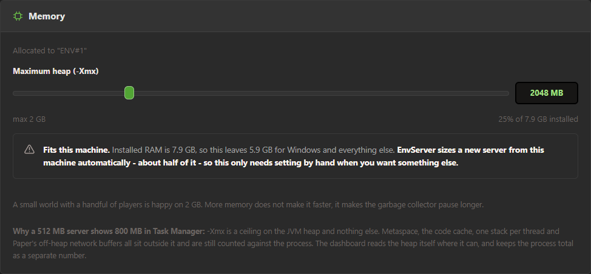

# EnvServer

A Minecraft server manager for Windows. It runs the server locally, in a folder on
your own machine, from a single `.exe` - and it works out what each server needs to
run: the right Java version for a Java server, or nothing at all for Mojang's
Bedrock one.

PaperMC, Folia, Purpur, Vanilla, Spigot, CraftBukkit, PocketMine-MP, Mojang's
Bedrock Dedicated Server, or any jar you already have.



## What it does

- **Runs the server locally** - one folder per server, with the world, plugins, logs
  and config where you would expect them. Nothing is uploaded, no account to make.
- **Java and Bedrock** - seven Java servers plus PocketMine-MP and Mojang's Bedrock
  Dedicated Server. Every one has a complete version list, the installer downloads all
  of them, and the UI adapts to what the software can actually do: a vanilla server
  has no Plugins tab because the official jar has no plugin loader, and a Bedrock
  server is never asked about Java.
- **Installs in the background** - a 50 MB jar, a 200 MB JDK or a Bedrock zip never
  blocks the UI. The sidebar shows every job with real progress, you can browse other
  views while it downloads, and closing the window minimises to the taskbar so the
  work continues.
- **Matches Java to the release** - see below. It downloads Eclipse Temurin if you do
  not have a suitable runtime.
- **Live console** - real stdout/stderr coloured by severity, plus a command box with
  one-click shortcuts for `list`, `say`, `tps`, `whitelist on` and the rest.
- **Server config** - `server.properties` edited with real controls, plus the EULA,
  the whitelist, the ops list and the ban list - all updating live.
- **Plugins** - add jars from Explorer, see what is there, remove them.
- **Backups** - zip the world on demand or on a timer while a server is up. A running
  server is `save-off`'d first so the archive is never half-written.
- **Updates, and going back** - the button next to the window controls checks GitHub
  for a newer release and offers to install it, or to reinstall an older version.
  Your servers and settings are never in the application folder, so neither can lose
  them.
- **Status** - player list, uptime, the actual JVM heap usage, and the server MOTD
  read from a genuine protocol query rather than guessed from the log: the Java
  Server List Ping for Java software, and RakNet over UDP for Bedrock.

## Runtimes: Java, PHP, and nothing

Each server is launched in one of three ways, and the app knows which:

| Software                                                              | What runs it                                             | Port   |
| --------------------------------------------------------------------- | -------------------------------------------------------- | ------ |
| PaperMC, Folia, Purpur, Vanilla, Spigot, CraftBukkit, Custom JAR      | `java -jar paper.jar`                                     | 25565  |
| PocketMine-MP                                                         | `php -d memory_limit=… PocketMine-MP.phar`                | 19132  |
| Bedrock Dedicated Server                                              | `bedrock_server.exe`, native, and no arguments at all    | 19132  |

That table is the reason the UI is worded the way it is. A PocketMine server is told
it needs **PHP**, and never told to install Java. A Bedrock server is told it needs
**nothing**, and its dashboard says "no JVM needed" in green instead of showing a red
"no Java" that would describe a problem it does not have.

- **Java** is found automatically, matched per Minecraft version, and downloaded on
  start if the machine has nothing suitable. See
  [Java matching](#java-matching-per-minecraft-version).
- **PHP** - PocketMine-MP only, 8.1 or newer - is **detected, never downloaded.**
  PHP for Windows is not one redistributable binary: each build comes from the PHP
  project or a third party under that publisher's licence, so shipping one inside
  this app is not this project's to do. EnvServer finds what is already installed,
  probes every candidate by running it, and refuses to start PocketMine with a
  specific message pointing at php.org if there is none. Settings gains a **PHP
  runtime** panel as soon as a PocketMine server exists - it lists what was found and
  where, and takes a path to pin a particular one.
- **Nothing** is the honest answer for Bedrock. `bedrock_server.exe` is a native
  Windows program, so there is no JVM to choose, download or report. `nogui` is not
  passed either: it is a Java habit that Bedrock would ignore.

**Bedrock listens on 19132, not 25565**, and Bedrock clients speak **RakNet over
UDP**. New Bedrock servers are created on 19132 and the dashboard says so. The
status monitor asks each server with the protocol it actually speaks, so a Bedrock
player's count and MOTD are real rather than permanently zero - sending the Java
status ping at a RakNet server gets nothing back, ever.

Bedrock's version list is read from Mojang's own server download page and the server
itself is downloaded from there, so it is Mojang's file under Mojang's terms;
PocketMine-MP versions come from the pmmp GitHub releases. **Neither is bundled with
this app**, and the Config tab says so rather than offering switches the software
ignores. Bedrock has no `eula.txt` - its terms are accepted on Mojang's download page
- so it is not sent to a file that will never exist.

## First run



One question: where server folders should live. Take the default or pick a folder -
that is the whole setup. The server software, the Java or PHP runtime it needs and
the EULA are handled by the app when they are needed, not as steps to walk through up
front.

Then the terms, which have to be accepted before the app does anything.



They stay under **Terms** in the sidebar afterwards, so nobody has to take the app's
word for what they agreed to, and can withdraw.

## Screenshots

| | |
| --- | --- |
|  |  |
| The dashboard: badges, live stats, players, and what to do next. | The console is the real process output, coloured by severity, with a command box. |
|  |  |
| A name, the software - Java and Bedrock listed separately - and the full version list for it. The line under the dropdown says what will run it, and which port. | Every build of the server's own software, per Minecraft version. |
|  |  |
| `server.properties`, the EULA, and the whitelist/ops/ban lists - which update while the server runs. | Add jars from Explorer, see what is there, remove them. |
|  |  |
| Memory, Java runtimes, folders, backups and the per-server overrides - plus a PHP panel once a PocketMine server exists. | The terms, readable and withdrawable from the sidebar at any time. |

## About memory

**`-Xmx` is a ceiling on the JVM heap, and nothing else.** A server set to 512 MB
will still show 700-900 MB in Task Manager, and that is correct: metaspace, the code
cache, one stack per thread and Paper's off-heap network buffers all live outside the
heap and are counted against the process. Nothing is being ignored.



So EnvServer reads the heap itself, with `jcmd GC.heap_info` on the JDK it launched
the server with. The dashboard shows **heap used against the heap ceiling** and keeps
the process total as a separate number with an explanation. It never labels the
process total "max".

New servers are sized from the machine - about half the installed RAM on a clean step.
If you set a ceiling this machine cannot honour, the dashboard, the memory panel and
the server's own console say so, instead of leaving the machine to thrash its pagefile.

## Updates, and going back

The button immediately left of the window controls opens a small panel that answers
two questions:

- **Is there a newer release?** It asks `api.github.com` for the releases, with a
  six-hour disk cache so it works offline and does not hammer GitHub. A dot appears on
  the button when there is one. Nothing is ever downloaded or installed without a
  click on it - an app that restarts its own UI uninvited is not a surprise worth
  shipping.

- **Can I go back?** Every launch records the version that ran, so the panel can offer
  to reinstall a build that used to work here - including ones no longer published.
  It downloads that release's own installer and runs it. There is no in-place patching
  and no self-repair: rewriting `app.asar` under a running Electron produces a program
  that only fails on the next launch.

**Your servers and settings cannot be lost by either.** They live in

```
%APPDATA%\envserver\data\
  servers\      one folder per server: world, plugins, logs, config
  runtime\      JDKs EnvServer downloaded
  backups\
  cache\
```

which is outside the install folder, and the panel shows you that path rather than
just asserting it. Updating replaces `EnvServer.exe` and `resources\app.asar`; it does
not touch the data folder. Only the app itself is ever replaced.

Versions follow `major.minor.patch`, and the tag on the release is the source of truth
for what is available.

## Java matching per Minecraft version

A Paper jar is compiled to a specific class-file version, so the JVM has to be the
one that release targets:

| Minecraft      | Java |
| -------------- | ---- |
| 1.13 - 1.16.5  | 8    |
| 1.17 - 1.17.1  | 16   |
| 1.18 - 1.20.4  | 17   |
| 1.20.5+        | 21   |
| 26.x and newer | 25   |

EnvServer asks the Paper API for the real number (`java.version.minimum`) and only
falls back to the table when the API cannot be reached. Two things follow:

- **Every candidate is probed with `java -version`.** A folder called `jdk-17` can
  contain Java 11, so the folder name is never trusted.
- **Selection order** is the exact feature version first, then the *smallest* runtime
  above it, then nothing. An older JVM cannot load the class files at all, so
  EnvServer refuses with a specific message instead of starting a JVM that is going
  to die.

Resolution is **pin -> global override -> automatic**, and the per-server panel says
out loud which runtime won and whether it is an exact or a forward-compatible match.
If nothing suitable is installed it is **downloaded automatically on start** - you
never have to go looking for a JDK.

## Run it

```bash
npm install
npm run assets     # generate the icon and icon.ico (already committed)
npm start          # launch
npm start -- --dev # launch with devtools
```

## Verify it

```bash
npm test           # syntax + module/bridge graph + 82 unit tests, no network
npm run smoke      # boots the real app, renders every view, hit-tests the chrome
npm run e2e        # downloads a JDK and a real server jar, starts it, pings it
npm run shot       # screenshot the running app to shot.png
npm run docs       # re-captures docs/screenshots/ into focused crops
```

The three layers exist because each catches a different class of bug:

| Command        | Catches                                                                 |
| -------------- | ----------------------------------------------------------------------- |
| `npm test`     | logic. Java matching, the runtime table, the launch command line per runtime, Bedrock version parsing and numeric version order, PocketMine release payloads, PHP compatibility and its explanation, the RakNet ping packet, the zip reader/writer, property parsing, varint framing, log classification, settings validation, and every import/export/bridge seam. |
| `npm run smoke`| the app itself. Every view rendered in a real Electron window, every nav item clicked, the console painted, nothing invisible covering the UI, zero renderer errors. |
| `npm run e2e`  | integration. A real JVM, a real world, a real status ping.               |

`npm run e2e` needs the network and about 300 MB of disk:

```bash
npm run e2e -- 1.16.5      # the Java 8 branch
npm run e2e -- 1.21.4      # the Java 21 branch
npm run e2e -- 26.3        # the Java 25 branch
```

### A note on `node --check`

`node --check file.js` parses a `.js` file in **CommonJS** goal, so an ES module
with an unbalanced bracket passes and exits `0`. That is not theoretical: it hid a
real syntax error in `ui/overlay.js` through an entire review pass, and only booting
the app caught it. `tools/syntax.js` works around it by checking renderer files
through a `.mjs` copy, and `npm test` runs it first.

## Build a Windows .exe

```bash
npm run dist       # NSIS installer + portable exe, output in release/
```

## Layout

```
src/
  main/
    main.js          window lifecycle, tray, dev flags, the smoke test
    preload.js       contextBridge (contextIsolation on, nodeIntegration off)
    ipc.js           the entire privileged surface + the background job registry
    store.js         settings + the server registry, re-validated on every load
    services/
      paths.js       on-disk layout, and path-segment rejection
      net.js         fetch + JSON, resumable download with SHA-256
      catalog.js     one dispatch for every software: versions, builds, install, remove
      runtime.js     what runs each software (java | php | none), and the preflight
      php.js         PHP discovery, probing and the "why is it missing" explanation
      paper.js       the v3 Paper API at fill.papermc.io, with a disk cache
      purpur.js      the Purpur API at api.purpurmc.org
      vanilla.js     piston-meta.mojang.com
      bedrock.js     Mojang's Bedrock server: version list from the download page
      pocketmine.js  PocketMine-MP releases from the pmmp GitHub releases
      updater.js     GitHub releases: check, install, and which versions ran here
      java.js        runtime discovery, per-version matching, Temurin download
      server.js      the process: command line per runtime, spawn, console, monitor
      config.js      server.properties, eula, ops/whitelist/bans, plugins
      ping.js        Server List Ping (Java) and RakNet unconnected ping (Bedrock)
      mojang.js      public profile lookup, for real whitelist UUIDs
      zip.js         zip reader + writer with no dependency
  renderer/
    index.html
    styles/          base.css (tokens, chrome) ui.css (kit) views.css (layouts)
                    theme.css (the skin; loaded last, overrides the other three)
                    updates.css (the popover under the titlebar button)
    js/
      app.js         bootstrap, router, sidebar, event bridge
      state.js       one store, subscribe/emit
      software.js    the software table: what exists, and what each can do
      jobs.js        background downloads: progress, cancel, tray awareness
      actions.js     the foreground flows (start, stop, EULA, plugins, memory)
      icons.js       inline SVG icon set
      dom.js         hyperscript helper (h) + the loader
      fmt.js         bytes / dates / durations
      ui/            toast, overlay, confirm, welcome, updates panel
      views/         dashboard, console, config, versions, plugins, settings, about
    assets/          generated: icon-32/48/64/128/256.png, icon.ico
docs/
  screenshots/    the images used above, produced by `npm run docs`
tools/
  syntax.js    ESM-aware syntax check
  graph.js     imports, exports and the preload <-> ipc contract
  test.js      unit tests
  e2e.js       end-to-end against a real server
  gen-assets.js  procedural icon generator
  shots.js     capture the README screenshots into docs/screenshots
  probe*.js    layout/behaviour probes, run with `electron . --probe=tools/probe.js`
               probe-runtime.js is the Bedrock one: it creates a PocketMine and a
               Bedrock server and checks what the app says about each.
```

## Architecture notes

**Everything talks to IPC, never to the DOM.** The renderer only knows about
`window.env` (see `preload.js`). That is the seam where every Paper, Adoptium,
Mojang, PHP and GitHub call lives, and the reason the UI can be tested without any
of it.

**One catalogue for nine software.** `paper:*`, `purpur:*` and `vanilla:*` were three
namespaces that grew a renderer branch each, and Spigot and CraftBukkit had no install
path at all because there was no fourth namespace to put them in. They are now
`catalog:versions`, `catalog:builds`, `catalog:install` and `catalog:remove`, with the
software id as an argument, and `catalog.js` routes it. Adding Bedrock cost two new
services and no new IPC namespace, no new preload surface and no new renderer branch.

**Two tables on purpose, with a test between them.** `runtime.js` owns the launch
facts - the executable, the arguments, the readiness pattern, whether there is an
EULA - and the renderer's `software.js` owns the wording and the icons. A renderer
view has to be able to say "needs PHP 8.1" synchronously while rendering, which it
cannot do with an IPC round trip. So the two tables are separate, and a unit test
asserts they agree on every software id and on every entry point it names - drift
there is how software ends up creatable but unstartable.

**`tools/graph.js` checks the seams a syntax check cannot.** It executes
`preload.js` against a stub electron to get the real exposed surface, then verifies
that every renderer call exists, every exposed method is called by *something*, and
every channel has a handler in both directions. Renaming a bridge method is
otherwise a silent runtime failure.

**Downloads are jobs, not modals.** `jobs.js` registers a job before the IPC call,
routes `evt:download` by `jobId`, and reports the result as a toast. That is what
makes 200 MB of JDK survivable: you can switch servers, browse versions, or close
the window to the tray while it downloads.

**Render discipline.** The store emits one change event and views rebuild wholesale,
except where a view has live input or a live stream:

- RAM sliders update only their label on `input` and persist on `change`.
  Re-rendering mid-drag would yank the slider out from under the cursor.
- The console does **not** re-render for log lines. `evt:log` fires many times a
  second, and a rebuild would reset the scroll position and destroy the command box.
- `server.properties` inputs never re-render, which is why they save on a 450 ms
  debounce instead of on every keystroke.
- The Config panel writes only the keys it was given, so the dozen settings this app
  does not model survive a round trip untouched.

Never call `saveSettings()` from inside a render function - emitting during render
re-enters the render.

**A throwing view must not take the app down.** `renderBody()` catches and shows the
message with a retry, and the boot-failure screen is closable. The old version
installed a full-window overlay that could not be dismissed.

**No dependency is pulled in for zip.** A Temurin JDK archive is ~25 000 entries, so
`zip.js` streams: it inflates one entry at a time when reading, and uses data
descriptors when writing so the CRC and sizes need not be known in advance. Every
entry name is checked so a crafted archive cannot escape the target directory.

## Deliberately not included

- **No bundled Mojang assets.** The app icon and every UI icon are generated or
  authored here. Shipping Mojang's textures, sounds or fonts inside a
  redistributable `.exe` is not something this project will do. The Bedrock server is
  downloaded from Mojang when you ask for it, and is not packaged.
- **No bundled PHP.** PHP for Windows is not one redistributable binary, so EnvServer
  finds the one you already have instead of shipping someone else's build. That is
  the one runtime PocketMine-MP needs and cannot come with.
- **No code signing.** The executable carries `RaolENV` as its company, so Windows
  shows a real publisher rather than a blank one. That is *not* the same as a signed
  build: a code-signing certificate is what removes the "Windows protected your PC"
  SmartScreen prompt, and no certificate is available here. If that prompt is the
  problem, buy one; nothing in this app's configuration can stand in for it.
- **No Fabric or NeoForge loader support.** Those need their own profile endpoints
  and library resolution.
- **No world or player editing.** Worlds are the server's own files; opening them in
  an editor while a server runs corrupts them. Backups and a folder button, yes.
- **No router configuration.** Opening a port on a router is a browser action, not a
  file one.
- **Removing a server never deletes its folder.** A world is not recoverable if it is
  deleted because a row was removed from a list.

## Legal

Not affiliated with Mojang or Microsoft. Minecraft is a trademark of Mojang AB.
Paper is built by the PaperMC project, PocketMine-MP by the PocketMine project. Java
runtimes are Eclipse Temurin from the Adoptium project. The Bedrock server is
downloaded from Mojang at the user's request rather than redistributed, and PHP is
detected on the user's machine rather than shipped. No Mojang assets are
redistributed by this project.